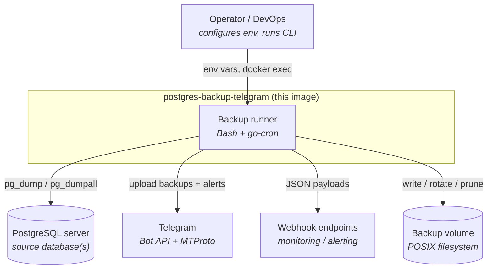
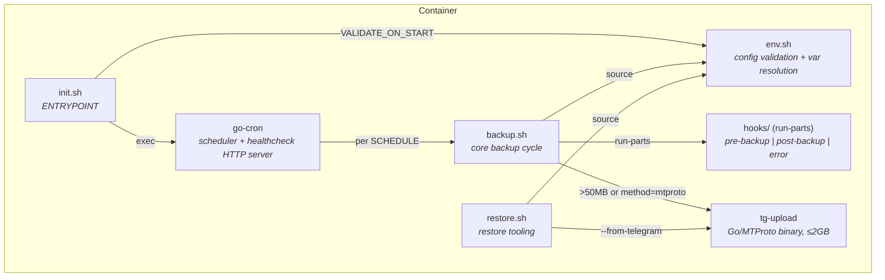
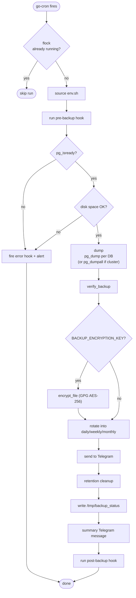
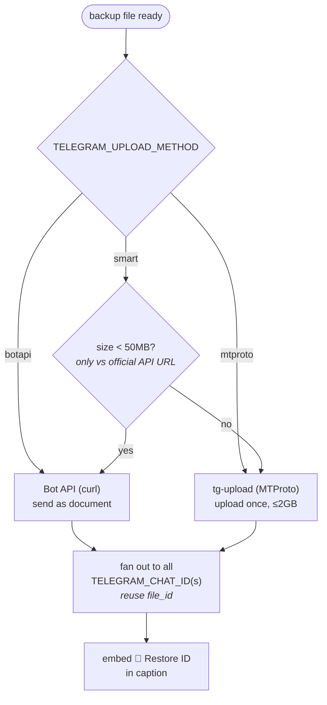

# Architecture

This image is a pure-Bash backup runner baked into a PostgreSQL base image —
there is no application runtime. A cron scheduler (`go-cron`) invokes
`backup.sh` on a schedule; the script dumps, verifies, encrypts, rotates,
delivers to Telegram, and prunes.

- [System context (C4 L1)](#system-context-c4-l1)
- [Containers & processes (C4 L2)](#containers--processes-c4-l2)
- [Entrypoint chain](#entrypoint-chain)
- [The backup cycle](#the-backup-cycle)
- [Rotation model](#rotation-model)
- [Format branches](#format-branches)
- [Telegram delivery](#telegram-delivery)

---

## System context (C4 L1)



---

## Containers & processes (C4 L2)



---

## Entrypoint chain

```
init.sh (ENTRYPOINT)
  └─ /env.sh            # standalone validation when VALIDATE_ON_START=TRUE
  └─ exec go-cron -s "$SCHEDULE" -- /backup.sh
```

`go-cron` (from prodrigestivill/go-cron, downloaded in the Dockerfile) owns the
schedule and serves the healthcheck on `HEALTHCHECK_PORT`. It invokes
`backup.sh` once per `SCHEDULE`.

**`env.sh` is dual-purpose and central:**

- **Sourced** by `backup.sh` / `restore.sh` — validates required vars, resolves
  `*_FILE` Docker-secret variants, exports `PGUSER`/`PGPASSWORD`/`PGHOST`/`PGPORT`,
  splits comma-separated `POSTGRES_DB` into `$POSTGRES_DBS`, and computes
  retention thresholds.
- **Executed** standalone (as `/env.sh`) by `init.sh` for startup validation —
  so it both `export`s vars and `exit 1`s on bad config.

---

## The backup cycle



`backup.sh` starts with `set -Eeo pipefail` and traps `ERR` to fire the `error`
hook.

---

## Rotation model

Each run writes a timestamped file into `last/`, then **hard-links** it into
`daily/`, `weekly/`, and `monthly/`. The hard link means the same inode is
shared — no extra disk is consumed. `*-latest` pointers are created per slot
(symlink / hardlink / none via `BACKUP_LATEST_TYPE`).

```
/backups/
  last/
    mydb-20260416-020000.sql.gz       # every backup
    mydb-latest.sql.gz -> (symlink)
  daily/
    mydb-20260416.sql.gz              # latest backup of the day  (hard link)
  weekly/
    mydb-202616.sql.gz                # latest backup of the ISO week
  monthly/
    mydb-202604.sql.gz                # latest backup of the month
```

Retention cleanup runs after each successful backup; each folder is pruned
independently using its own `BACKUP_KEEP_*` threshold (see
[CONFIGURATION.md → Retention Math](CONFIGURATION.md#retention-math)).

> Directory-format dumps (`-Fd`) cannot be hard-linked, so they are `cp -r`'d and
> `tar.gz`'d for Telegram. Because of hard links + symlinks, `BACKUP_DIR` **must**
> be a POSIX filesystem — VFAT, exFAT, and SMB/CIFS are not supported.

---

## Format branches

The same format-specific logic appears in both `backup.sh` (verify, encryption
suffix) and `restore.sh` (decrypt → un-tar → dispatch by extension). Keep them
in sync.

| Format | Produced by | Verified via | Restored via |
|---|---|---|---|
| gzip SQL (`.sql.gz`) | default `pg_dump` | magic-byte check (`1f8b`); `-Z0` uncompressed tolerated | `psql` / `pg_restore` |
| directory (`-Fd`) | `pg_dump -Fd` | `pg_restore --list` | `pg_restore` |
| cluster | `pg_dumpall` (`POSTGRES_CLUSTER=TRUE`) | **skipped** (plain SQL) | `psql -d postgres` |
| GPG (`.gpg`) | wraps any of the above | after decrypt | decrypt, then dispatch |

---

## Telegram delivery



- The 50 MB limit is enforced **only** against the official
  `https://api.telegram.org`; a custom self-hosted Bot API URL bypasses it.
- MTProto upload requires `TELEGRAM_API_ID` / `TELEGRAM_API_HASH`; without them,
  oversized files are reported with a text alert instead.
- Multi-chat: `TELEGRAM_CHAT_ID` accepts a comma-separated list — the file is
  uploaded once and the resulting `file_id` is reused per chat.
- Each delivered backup carries a `🔖 Restore ID` in its caption, consumed by
  `restore --from-telegram`. See [LARGE_FILES.md](LARGE_FILES.md).
