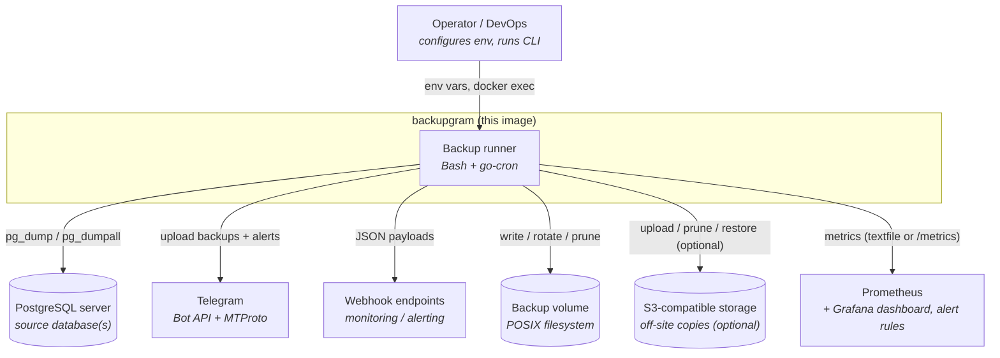
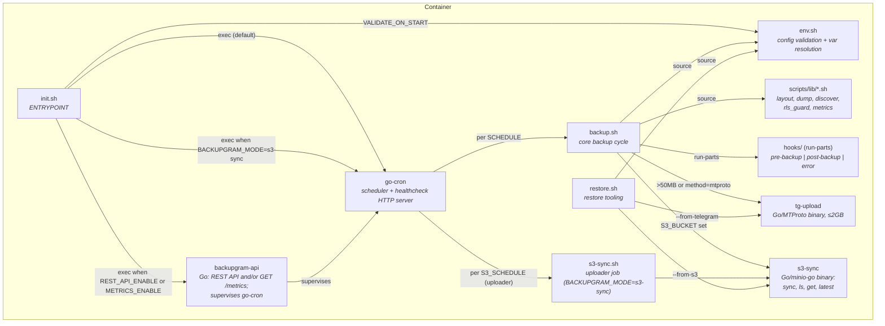
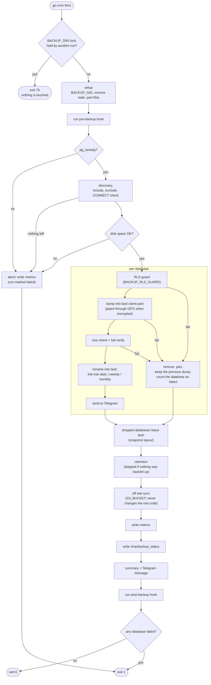
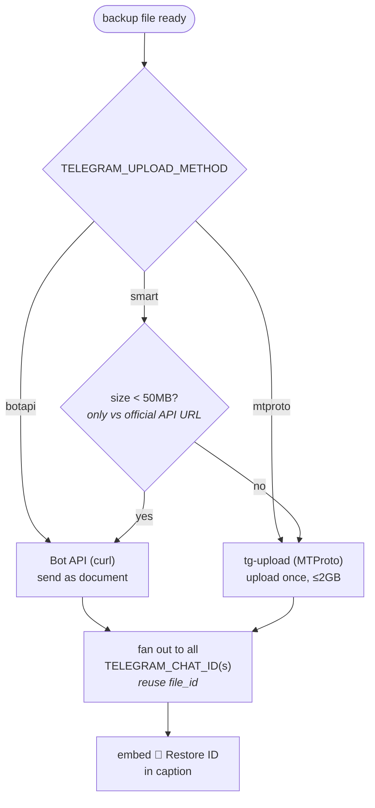
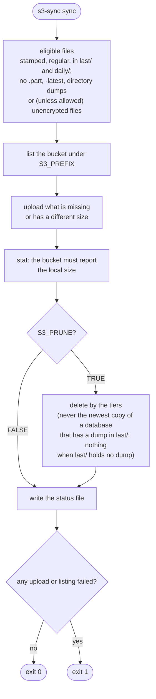

# Architecture

This image is a pure-Bash backup runner baked into a PostgreSQL base image —
there is no application runtime. A cron scheduler (`go-cron`) invokes
`backup.sh` on a schedule; the script dumps each database (encrypting as it
streams), verifies the result, rotates it, delivers it to Telegram, prunes old
files, optionally copies the dumps to S3-compatible storage, and writes Prometheus
metrics.

- [System context (C4 L1)](#system-context-c4-l1)
- [Containers & processes (C4 L2)](#containers--processes-c4-l2)
- [Entrypoint chain](#entrypoint-chain)
- [The backup cycle](#the-backup-cycle)
- [Rotation model](#rotation-model)
- [Format branches](#format-branches)
- [Telegram delivery](#telegram-delivery)
- [Off-site copies](#off-site-copies)

---

## System context (C4 L1)


```mermaid
flowchart TB
    operator["Operator / DevOps<br/><i>configures env, runs CLI</i>"]
    subgraph sys["backupgram (this image)"]
        runner["Backup runner<br/><i>Bash + go-cron</i>"]
    end
    pg[("PostgreSQL server<br/><i>source database(s)</i>")]
    tg["Telegram<br/><i>Bot API + MTProto</i>"]
    hook["Webhook endpoints<br/><i>monitoring / alerting</i>"]
    vol[("Backup volume<br/><i>POSIX filesystem</i>")]
    s3[("S3-compatible storage<br/><i>off-site copies (optional)</i>")]

    operator -->|env vars, docker exec| runner
    runner -->|pg_dump / pg_dumpall| pg
    runner -->|upload backups + alerts| tg
    runner -->|JSON payloads| hook
    runner -->|write / rotate / prune| vol
    runner -->|"upload / prune / restore (optional)"| s3
    runner -->|"metrics (textfile or /metrics)"| prom["Prometheus<br/><i>+ Grafana dashboard, alert rules</i>"]
```

---

## Containers & processes (C4 L2)


```mermaid
flowchart TB
    subgraph container["Container"]
        init["init.sh<br/><i>ENTRYPOINT</i>"]
        env["env.sh<br/><i>config validation + var resolution</i>"]
        cron["go-cron<br/><i>scheduler + healthcheck HTTP server</i>"]
        api["backupgram-api<br/><i>Go: REST API and/or GET /metrics;<br/>supervises go-cron</i>"]
        backup["backup.sh<br/><i>core backup cycle</i>"]
        lib["scripts/lib/*.sh<br/><i>layout, dump, discover,<br/>rls_guard, metrics</i>"]
        restore["restore.sh<br/><i>restore tooling</i>"]
        hooks["hooks/ (run-parts)<br/><i>pre-backup | post-backup | error</i>"]
        tgupload["tg-upload<br/><i>Go/MTProto binary, &le;2GB</i>"]
        s3job["s3-sync.sh<br/><i>uploader job (BACKUPGRAM_MODE=s3-sync)</i>"]
        s3sync["s3-sync<br/><i>Go/minio-go binary:<br/>sync, ls, get, latest</i>"]
    end

    init -->|"VALIDATE_ON_START"| env
    init -->|"exec (default)"| cron
    init -->|"exec when REST_API_ENABLE or METRICS_ENABLE"| api
    init -->|"exec when BACKUPGRAM_MODE=s3-sync"| cron
    api -->|supervises| cron
    cron -->|"per SCHEDULE"| backup
    cron -->|"per S3_SCHEDULE (uploader)"| s3job
    backup -->|source| env
    backup -->|source| lib
    backup -->|run-parts| hooks
    backup -->|">50MB or method=mtproto"| tgupload
    backup -->|"S3_BUCKET set"| s3sync
    s3job --> s3sync
    restore -->|source| env
    restore -->|"--from-telegram"| tgupload
    restore -->|"--from-s3"| s3sync
```

---

## Entrypoint chain

```
init.sh (ENTRYPOINT)
  ├─ BACKUPGRAM_MODE=s3-sync:  /scripts/s3-env.sh, then exec go-cron -s "$S3_SCHEDULE" -- /scripts/s3-sync.sh
  └─ /env.sh            # standalone validation when VALIDATE_ON_START=TRUE
  ├─ REST_API_ENABLE=TRUE or METRICS_ENABLE=TRUE:  exec backupgram-api   # supervises go-cron
  └─ otherwise:                                    exec go-cron -s "$SCHEDULE" -- /backup.sh
```

`go-cron` (from prodrigestivill/go-cron, downloaded in the Dockerfile) owns the
schedule and serves the healthcheck on `HEALTHCHECK_PORT`. It invokes
`backup.sh` once per `SCHEDULE`. With the REST API or metrics on,
`backupgram-api` is PID 1 and runs go-cron as a child; it serves `/healthz`,
plus `/metrics` when `METRICS_ENABLE=TRUE` and the token-protected REST routes
when `REST_API_ENABLE=TRUE` (see [MONITORING.md](MONITORING.md) and
[REST_API.md](REST_API.md)).

With `BACKUPGRAM_MODE=s3-sync`, `init.sh` validates only the S3 settings
(`scripts/s3-env.sh`: no `POSTGRES_*`, no key) and `exec`s go-cron with
`scripts/s3-sync.sh` on `S3_SCHEDULE`: the container is an off-site uploader and
nothing else (see [Off-site copies](#off-site-copies)).

`backup.sh` sources its helpers from `scripts/lib/`: `layout.sh` (folders, links,
retention), `dump.sh` (format detection, streaming dump, verification),
`discover.sh` (database discovery), `rls_guard.sh` (row-level security checks),
`metrics.sh` (Prometheus output) and `s3.sh` (off-site copies).

**`env.sh` is dual-purpose and central:**

- **Sourced** by `backup.sh` / `restore.sh` — validates required vars, resolves
  `*_FILE` Docker-secret variants, exports `PGUSER`/`PGPASSWORD`/`PGHOST`/`PGPORT`,
  splits comma-separated `POSTGRES_DB` into `$POSTGRES_DBS`, and computes
  retention thresholds.
- **Executed** standalone (as `/env.sh`) by `init.sh` for startup validation —
  so it both `export`s vars and `exit 1`s on bad config.

---

## The backup cycle


```mermaid
flowchart TD
    start([go-cron fires]) --> lock{"BACKUP_DIR/.lock<br/>held by another run?"}
    lock -->|yes| busy(["exit 75<br/>nothing is touched"])
    lock -->|no| setup["setup<br/>BACKUP_GID, remove stale .part files"]
    setup --> pre[run pre-backup hook]
    pre --> ready{pg_isready?}
    ready -->|no| abort
    ready -->|yes| disc["discovery<br/>include, exclude, CONNECT check"]
    disc -->|"nothing left"| abort
    disc --> disk{disk space OK?}
    disk -->|no| abort
    disk -->|yes| guard

    subgraph perdb["per database"]
        guard["RLS guard<br/>(BACKUP_RLS_GUARD)"] --> dump["dump into last/.name.part<br/>(piped through GPG when encrypted)"]
        dump --> accept["size check + full verify"]
        accept --> rename["rename into last/,<br/>link into daily / weekly / monthly"]
        rename --> send[send to Telegram]
        guard -->|fail| keep
        dump -->|fail| keep
        accept -->|fail| keep["remove .part,<br/>keep the previous dump,<br/>count the database as failed"]
    end

    send --> dropped["dropped databases leave last/<br/>(snapshot layout)"]
    keep --> dropped
    dropped --> retention["retention<br/>(skipped if nothing was backed up)"]
    retention --> offsite["off-site sync<br/>(S3_BUCKET; never changes the exit code)"]
    offsite --> metrics[write metrics]
    metrics --> status["write /tmp/backup_status"]
    status --> summary[summary + Telegram message]
    summary --> post[run post-backup hook]
    post --> result{any database failed?}
    result -->|no| ok([exit 0])
    result -->|yes| fail([exit 1])
    abort["abort: write metrics<br/>(run marked failed)"] --> fail
```

`backup.sh` starts with `set -Eeo pipefail` and traps `ERR` to fire the `error`
hook. A failing database does not stop the run: the others still dump, and the
run ends with exit code `1`. The lock is `${BACKUP_DIR}/.lock`, so runs of the same
configuration — the scheduled run and a manual `docker exec … backup`, or two
containers with the same settings on one volume — run one at a time; a busy run
prints one line and exits `75` without changing anything. Every file of a run
carries the run's start time. With `S3_BUCKET` set, every run that reaches the dumps
runs the off-site sync after retention (even when every dump failed; a run that
aborts before the dumps does not sync), and its result goes into the metrics; a
problem there is a warning and never changes the exit code.

> **One `BACKUP_DIR` per server/configuration.** Retention prunes every backup file
> in each folder and, in `snapshot` layout, `last/` drops the dumps of databases the
> server no longer lists. Two different servers, or two retention settings, sharing
> one folder would therefore delete each other's files; the lock does not prevent it.

> Commands whose failure `backup.sh` handles itself run inside `if` / `||`
> conditions, where `set -e` does not apply, so each command in those pipelines is
> checked explicitly.

---

## Rotation model

Each run writes each database's dump into `last/` (first as a hidden
`.<name>.part` file, renamed into place once verified), then **hard-links** it into
`daily/`, `weekly/`, and `monthly/`. The hard link means the same inode is
shared — no extra disk is consumed. `*-latest` pointers are created per slot
(symlink / hardlink / none via `BACKUP_LATEST_TYPE`). `BACKUP_LAYOUT` picks how the
other folders are named and filled.

**`period`** (default) — one file per day, ISO week and month, replaced by each run
of that period:

```
/backups/
  last/
    mydb-20260416-020000.sql.gz       # every backup
    mydb-latest.sql.gz -> (symlink)
  daily/
    mydb-20260416.sql.gz              # latest backup of the day  (hard link)
  weekly/
    mydb-202616.sql.gz                # latest backup of the ISO week
  monthly/
    mydb-202604.sql.gz                # latest backup of the month
```

**`snapshot`** — the same timestamped name in every folder; `weekly/` only gets
the Sunday run and `monthly/` the run on the 1st; `last/` holds exactly the newest
dump of each database that still exists:

```
/backups/
  last/
    mydb-20260416-020000.sql.gz       # newest dump per existing database
  daily/
    mydb-20260416-020000.sql.gz       # every run  (hard link)
  weekly/
    mydb-20260412-020000.sql.gz       # the Sunday run
  monthly/
    mydb-20260401-020000.sql.gz       # the run on the 1st
```

A dropped database's dump and its `-latest` entry leave `last/`; its
`daily/`, `weekly/` and `monthly/` copies stay until retention removes them.

Retention cleanup runs once per run, after the loop over every database, and
covers every backup file of each folder, not just this run's databases; each folder
is pruned independently using its own `BACKUP_KEEP_*` threshold (see
[CONFIGURATION.md → Layouts](CONFIGURATION.md#layouts) and
[Retention Math](CONFIGURATION.md#retention-math)). It is skipped when no database
was backed up in the run, and it leaves alone the copies of every database that
failed in the run (its last good dumps).

> Directory-format dumps (`-Fd`) cannot be hard-linked, so they are `cp -r`'d and
> `tar.gz`'d for Telegram. Because of hard links + symlinks, `BACKUP_DIR` **must**
> be a POSIX filesystem — VFAT, exFAT, and SMB/CIFS are not supported.

---

## Format branches

The same format-specific logic appears in both `backup.sh` (`scripts/lib/dump.sh`:
dump, verification, encryption suffix) and `restore.sh` (decrypt → un-tar →
dispatch by extension). Keep them in sync. The format is read once from
`POSTGRES_EXTRA_OPTS` (`-Fc`, `-Ft`, `-Fd`, `-Z…`).

Encryption streams: `pg_dump` (or `pg_dumpall | gzip`) is piped into `gpg`, which
writes the `.part` file, so no unencrypted dump touches the disk. Every stage of each
pipe must succeed for the dump to be accepted.

| Format | Produced by | Verified by (before the rename) | Restored via |
|---|---|---|---|
| gzip SQL (`.sql.gz`) | `pg_dump` (default `-Z1`) | `gunzip -c >/dev/null` | `gunzip \| psql` |
| plain SQL, uncompressed (`-Z0`) or another codec | `pg_dump` | size check only (encrypted: decrypt to `/dev/null`) | `psql` |
| custom (`-Fc`) or tar (`-Ft`) | `pg_dump -Fc` / `-Ft` | `pg_restore -f /dev/null` (encrypted: `gpg --decrypt \| pg_restore -f /dev/null`) | `pg_restore` |
| directory (`-Fd`) | `pg_dump -Fd` into a `.part` directory | `pg_restore -f /dev/null` | `pg_restore` |
| cluster | `pg_dumpall \| gzip` (`POSTGRES_CLUSTER=TRUE`) | `gunzip -c >/dev/null` | `psql -d postgres` |
| GPG (`.gpg`) | wraps any of the above except directory | through the decryption pipe | streamed into the restore; a tar-archived directory decrypts to a temp file |

Directory-format dumps are never encrypted. A wrong key or a damaged encrypted
file makes `restore` exit `1` with
`❌ Could not read the backup (wrong BACKUP_ENCRYPTION_KEY or a damaged file).`

---

## Telegram delivery


```mermaid
flowchart TD
    file([backup file ready]) --> method{TELEGRAM_UPLOAD_METHOD}
    method -->|botapi| botapi
    method -->|mtproto| mtproto
    method -->|smart| size{size &lt; 50MB?<br/><i>only vs official API URL</i>}
    size -->|yes| botapi["Bot API (curl)<br/>send as document"]
    size -->|no| mtproto["tg-upload (MTProto)<br/>upload once, &le;2GB"]
    botapi --> fanout["fan out to all<br/>TELEGRAM_CHAT_ID(s)<br/><i>reuse file_id</i>"]
    mtproto --> fanout
    fanout --> caption["embed 🔖 Restore ID<br/>in caption"]
```

- The 50 MB limit is enforced **only** against the official
  `https://api.telegram.org`; a custom self-hosted Bot API URL bypasses it.
- MTProto upload uses your `TELEGRAM_API_ID` / `TELEGRAM_API_HASH`, or the image's
  built-in shared default app when they are unset (`env.sh` resolves it from the
  root-only `/etc/backupgram/default-telegram-api`, baked from a build secret and
  kept out of the container's env). With `TELEGRAM_USE_DEFAULT_API=FALSE` and no
  creds, oversized files are reported with a text alert instead.
- Multi-chat: `TELEGRAM_CHAT_ID` accepts a comma-separated list — the file is
  uploaded once and the resulting `file_id` is reused per chat.
- Each delivered backup carries a `🔖 Restore ID` in its caption, consumed by
  `restore --from-telegram`. See [LARGE_FILES.md](LARGE_FILES.md).

---

## Off-site copies

One Go binary, `s3-sync` (minio-go, built into the image like `tg-upload`), does the
work; `scripts/s3-env.sh` resolves and validates the `S3_*` settings and
`scripts/lib/s3.sh` runs it and renders the metrics. It runs in one of two places:

- **End of a backup run:** `backup.sh` calls `s3-sync sync` after retention, in every
  run that reaches the dumps.
- **Uploader container** (`BACKUPGRAM_MODE=s3-sync`): go-cron runs `scripts/s3-sync.sh`
  on `S3_SCHEDULE`, independently of the backup runs. It takes a lock, runs one sync,
  writes the off-site metrics to `METRICS_TEXTFILE_DIR` and exits `1` when the sync
  failed (so go-cron answers `503` and the container shows unhealthy). It needs no
  database settings and no key, and the backup folder can be mounted read-only.

Each sync stops at `S3_SYNC_TIMEOUT` (an hour by default; `SIGTERM` stops it too) and
then counts as failed, so a stalled endpoint never holds the backup's lock or the
uploader's.


```mermaid
flowchart TD
    sync([s3-sync sync]) --> elig["eligible files<br/>stamped, regular, in last/ and daily/;<br/>no .part, -latest, directory dumps<br/>or (unless allowed) unencrypted files"]
    elig --> list["list the bucket under S3_PREFIX"]
    list --> plan["upload what is missing<br/>or has a different size"]
    plan --> verify["stat: the bucket must report<br/>the local size"]
    verify --> prune{S3_PRUNE?}
    prune -->|TRUE| tiers["delete by the tiers<br/>(never the newest copy of a database<br/>that has a dump in last/; nothing<br/>when last/ holds no dump)"]
    prune -->|FALSE| status
    tiers --> status["write the status file"]
    status --> result{any upload or listing failed?}
    result -->|no| ok([exit 0])
    result -->|yes| fail([exit 1])
```

A key is `<S3_PREFIX>/<db>/<file name>`, one object per dump. The status file (a
temp file, renamed into place) is two kinds of lines, from a listing taken after
the uploads and the pruning:

```
result <ok|failed> <unix time finished>
newest <db> <stamp unix time> <bytes> <key>        # one per database with a dump in last/
newest <db> 0 0 -                                  # ... when the bucket holds none of its dumps
```

There are no `newest` lines when that final listing failed. `lib/s3.sh` deletes the
status file before each sync, writes `result failed` itself when `s3-sync` ended without
one, and turns it into the `backupgram_offsite_*` metrics (none before the container's
first sync). `restore --from-s3`
and `list --s3` use the same binary (`s3-sync latest`, `get` and `ls`): the object
streams from the bucket into `gpg` and the restore, with nothing in clear text on
disk. The dump names carry local time and the sync parses them in its own time zone,
so the backup service and the uploader must share `TZ`. Settings, retention and
disaster recovery: [OFFSITE.md](OFFSITE.md).
